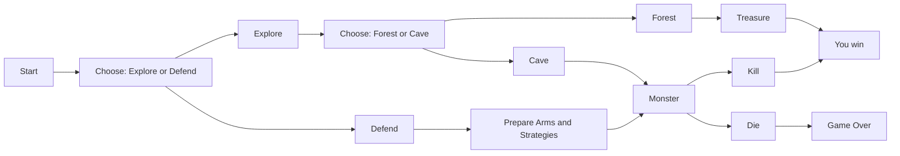

# Adventure Game
### Explore and Defend
---
## Requirements
**Minimum number of players:** 1

**Platform:** PC (Windows, macOS, Linux)

**Controls:** Keyboard and Mouse

---
## Official Website

[**Visit the game website**](http://www.ulusofona.pt)


---




## Notes and Tips
**How to Win the Game**

- Choose to Explore and head to the Forest to find the treasure

- Defend yourself against the monster in the Cave

- Prepare your arms and strategies to defeat the monster

```mermaid
graph LR
    A[Player] --> B[Weapons]
    A --> C[Armors]
    B --> E[Sword]
    B --> F[Bow]
    C --> G[Helmet]
    C --> H[Shield]
